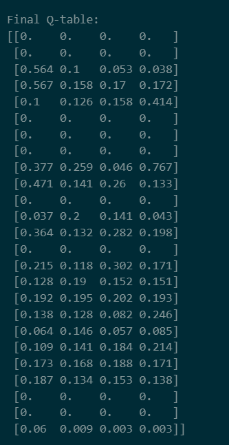
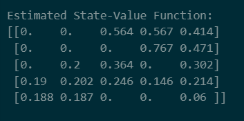
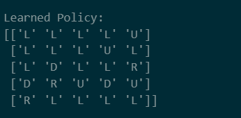
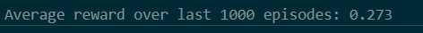
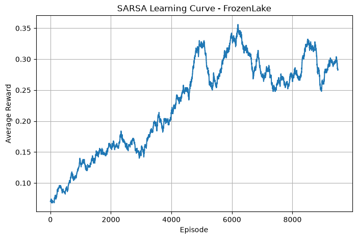

# Implementation-of-SARSA-Control-Algorithm-using-Gymnasium

## Aim

To implement the **SARSA control algorithm** using the Gymnasium `FrozenLake-v1` environment and learn an action-value function that helps the agent select better actions for reaching the goal state while avoiding holes.

---

## Problem Statement
To implement the SARSA control algorithm using the Gymnasium FrozenLake-v1 environment and learn an optimal action-value function (Q-table) through interaction with the environment. The agent should learn a policy that enables it to reach the goal while avoiding the holes by balancing exploration and exploitation using an epsilon-greedy strategy.


## Software Requirements
- Python 3.x
- Jupyter Notebook / Google Colab
- Gymnasium
- NumPy
- Matplotlib


## Environment Description
The FrozenLake-v1 environment consists of a grid containing a starting state, frozen surfaces, holes, and a goal state. The agent moves through the grid using four possible actions: Left, Down, Right, and Up. Reaching the goal provides a reward of 1, while falling into a hole or reaching other states provides a reward of 0. The environment can be slippery, making the agent's movement stochastic. SARSA learns an action-value function by interacting with this environment and updating Q-values based on the action actually selected in the next state.


## Theory

SARSA stands for:

$$
S_t, A_t, R_{t+1}, S_{t+1}, A_{t+1}
$$

It updates the Q-value using the action actually selected in the next state.

The SARSA update rule is:

$$
Q(S_t,A_t) \leftarrow Q(S_t,A_t) + \alpha
\left[
R_{t+1} + \gamma Q(S_{t+1},A_{t+1}) - Q(S_t,A_t)
\right]
$$

Where:

| Symbol | Meaning |
|---|---|
| $S_t$ | Current state |
| $A_t$ | Current action |
| $R_{t+1}$ | Reward received after taking action $A_t$ |
| $S_{t+1}$ | Next state |
| $A_{t+1}$ | Next action selected using the current policy |
| $\alpha$ | Learning rate |
| $\gamma$ | Discount factor |
| $Q(s,a)$ | Action-value function |

---

## Epsilon-Greedy Policy

SARSA uses an epsilon-greedy policy for action selection.

With probability $\epsilon$, the agent explores by selecting a random action.

With probability $1-\epsilon$, the agent exploits by selecting the action with the highest Q-value.

$$
a =
\begin{cases}
\text{random action}, & \text{with probability } \epsilon \\
\arg\max_a Q(s,a), & \text{with probability } 1-\epsilon
\end{cases}
$$

---


## Algorithm
- Initialize the Q-table with zeros and set $\alpha$, $\gamma$, $\epsilon$, $\epsilon_{min}$, and decay rate.
- Reset the FrozenLake environment and obtain the initial state.
- Select an initial action using the epsilon-greedy policy.
- Execute the selected action and observe the next state and reward.
- Select the next action using the epsilon-greedy policy.
- Update the Q-value using the SARSA update rule and continue until the episode terminates.
- Store the episode reward, decay $\epsilon$, and repeat for all training episodes.

## Python Program
```
Developed By : Krishna Prasad S
Register No. : 212223230108
```
```python

# -------------------------------------------------
# SARSA Training
# -------------------------------------------------

episode_rewards = []

for episode in range(num_episodes):

    state, info = env.reset()

    action = epsilon_greedy_action(state, epsilon)

    total_reward = 0

    for step in range(max_steps_per_episode):

        next_state, reward, terminated, truncated, info = env.step(action)

        next_action = epsilon_greedy_action(next_state, epsilon)

        Q[state, action] += alpha * (
            reward + gamma * Q[next_state, next_action] - Q[state, action]
        )

        state = next_state
        action = next_action

        total_reward += reward

        if terminated or truncated:
            break

    episode_rewards.append(total_reward)
    epsilon = max(epsilon_min, epsilon * epsilon_decay)

```
---

## Output

### Final Q-table:




### Estimated State-Value Function:



### Learned Policy:



### Average reward over last 1000 episodes: 



### SARSA Learning Graph:



## Result
```text

The SARSA algorithm successfully learned a policy for navigating the FrozenLake environment while improving the agent's ability to reach the goal and avoid holes.

```

---

## Inference
```text

The experiment demonstrates that SARSA can learn an effective policy through on-policy reinforcement learning. Since SARSA updates the Q-value using the action actually selected by the epsilon-greedy policy, its learned policy accounts for the exploration behavior of the agent. As training progresses and epsilon decreases, the agent performs more exploitation and generally achieves better rewards. The experiment shows that learning in slippery FrozenLake environment is challenging because the agent's movements are stochastic, but repeated training enables it to learn a useful policy.

```
---

